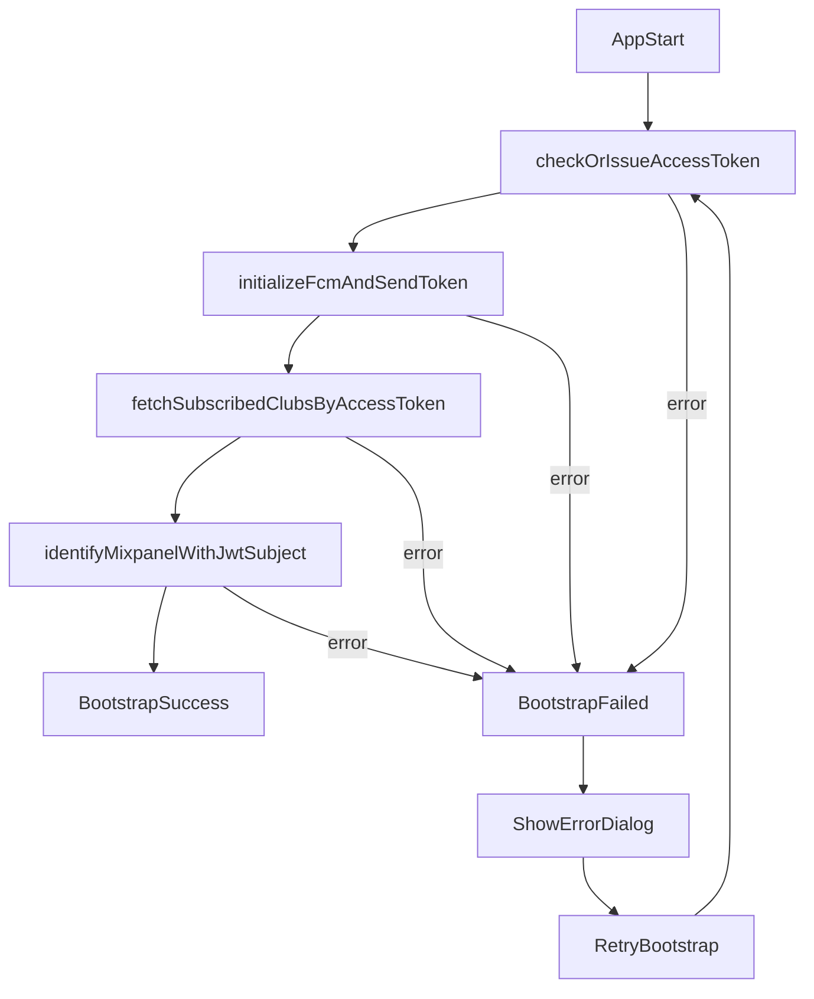

# Token Bootstrap Plan

## 배경

- 기존 구조는 `FCM 토큰`을 중심으로 사용자와 구독 상태를 연결합니다.
- FCM 토큰이 변경되면 기존 토큰에 연결된 구독 상태와 알림 연계가 끊길 위험이 있습니다.
- 이를 해결하기 위해 앱 시작 기준 식별 축을 `Access Token`으로 전환합니다.

## 목표

- 앱 시작 시 아래 순서를 고정합니다.
  - `Access Token 확인/발급`
  - `FCM 토큰 발급 + 서버 전송`
  - `Access Token 기반 구독 목록 조회`
  - `JWT 기반 Mixpanel identify`
- 위 단계가 모두 끝날 때까지 Splash를 유지합니다.
- 실패하면 Splash 위에 오류 다이얼로그를 띄우고 `재시도` 버튼으로 전체 시퀀스를 재실행합니다.
- FCM 토큰은 더 이상 로컬 저장소에 저장하지 않습니다.

## 초기화 플로우

## 구현 요약

- 앱 진입 오케스트레이션: `app/_layout.tsx`
  - 상태: `idle/running/success/failed`
  - `success` 전까지 `CustomSplashScreen` 종료 차단
  - 실패 시 `BootstrapErrorDialog` 표시 + 재시도
- Access Token
  - 발급/보장: `services/auth-token.service.ts`
  - 저장/조회/JWT subject 파싱: `services/auth-token-storage.ts`
  - API 헤더 주입: `services/api.ts` 요청 인터셉터 `Authorization: Bearer`
- FCM
  - 로컬 저장 제거: `services/fcm.service.ts`
  - 런타임 메모리 캐싱만 사용
  - strict 모드 초기화로 부트스트랩 실패 처리 가능
- 구독 목록
  - 조회/저장 유틸: `services/subscription.service.ts`
  - Access Token 기반 조회 후 로컬 저장
  - Provider 재동기화: `contexts/subscribed-clubs-context.tsx`의 `refreshKey`
- Mixpanel
  - JWT subject(`sub`, `userId`, `user_id`, `id`) 기반 identify 우선
  - 구현: `contexts/mixpanel-context.tsx`, `utils/mixpanel.ts`

## API 클라이언트 분류 규칙

- `services/api.ts`는 두 클라이언트를 제공합니다.
  - `publicApi`: AccessToken 없이 호출해야 하는 요청
  - `authApi`: AccessToken이 필요한 요청 (`Authorization: Bearer <accessToken>` 자동 주입)
- 현재 분류
  - `publicApi`
    - `POST /auth/student` (AccessToken 발급)
    - 공개 동아리 조회 API (`/api/club/*`)
  - `authApi`
    - `PUT /api/student/fcm-token`
    - `GET /api/student/subscriptions`
    - `PUT /api/v2/fcm/subscribe`
- 신규 API 추가 시 반드시 `publicApi` 또는 `authApi`를 명시적으로 선택합니다.

## API 명세

- Access Token 발급: `POST /auth/student`
  - payload:
    - `sub`: UUID 문자열 (클라이언트에서 생성/보관한 subject)
    - `iat`: Unix timestamp(초)
  - 성공 응답:
    - `statuscode: "200"`
    - `message: "ok"`
    - `data.accessToken: "<JWT>"`
- FCM TOKEN Rotation: `PUT /api/student/fcm-token` (Authorization 헤더 사용)
  - 요청 body: `{ "fcmToken": "<fcmToken>" }`
  - 성공 응답: `statuscode: "200"`, `message: "ok"`, `data: {...}`
- 구독 목록 조회: `GET /api/student/subscriptions` (Authorization 헤더 사용)
  - 필수 query: `studentToken` (FCM 토큰)
  - 성공 응답: `data.clubIds: string[]`
  - 실패 응답:
    - `400`: `studentToken` 누락/형식 오류
    - `401`: JWT 유효하지 않음
    - `404`: `studentToken` 미존재

## 저장소 정책

- `@access_token`: 저장
- `@subscribed_clubs`: 저장
- `@fcm_token`: 저장하지 않음

## 실패 정책

- 부트스트랩 단계 중 하나라도 실패하면 `failed` 상태로 전이
- Splash는 유지되고 오류 다이얼로그를 노출
- `재시도` 클릭 시 전체 초기화 시퀀스를 처음부터 재실행

## QA 체크리스트

- 토큰 없음: Access Token 발급 후 정상 진입
- 토큰 있음: 재발급 없이 정상 진입
- FCM 권한 거부: 오류 다이얼로그 표시 + 재시도 동작
- 네트워크 장애: 오류 다이얼로그 표시 + 복구 후 재시도 성공
- 구독 목록 조회 성공 시 로컬 저장/화면 반영 확인
- Mixpanel identify가 JWT subject 기반으로 설정되는지 확인

